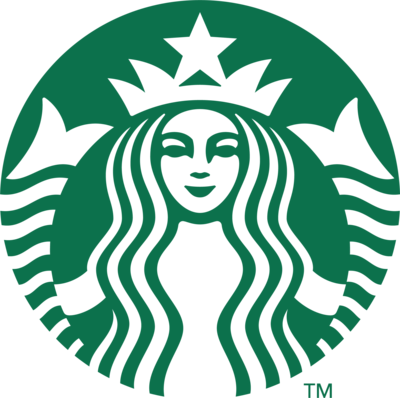

<a name="readme-top">

<br/>

<br />
<div align="center">
  <a href="https://github.com/zyx-0314/">
  <!-- TODO: If you want to add logo or banner you can add it here -->
    
  </a>
<!-- TODO: Change Title to the name of the title of your Project -->
  <h3 align="center">Starbucks</h3>
</div>
<!-- TODO: Make a short description -->
<div align="center">
Starbucks is a well known coffeehouse
</div>
Starbucks is the well known largest coffeehouse in the world. Known for its premium coffee, cozy atmosphere, and customizable drinks. Our purpose is to serve and offer beverages, pastries, and snacks, catering to coffee lovers worldwide.
<br />

<!-- TODO: Change the zyx-0314 into your github username  -->
<!-- TODO: Change the WD-Template-Project into the same name of your folder -->


[](https://wakatime.com/badge/user/15cb8e1d-e6bf-4f22-b292-90e995925fd6/project/5897fae2-7240-4fbe-aa04-1fa97f1739a2)


---


<br />
<br />

<!-- TODO: If you want to add more layers for your readme -->
<details>
  <summary>Table of Contents</summary>
  <ol>
    <li>
      <a href="#overview">Overview</a>
      <ol>
        <li>
          <a href="#key-components">Key Components</a>
        </li>
        <li>
          <a href="#technology">Technology</a>
        </li>
      </ol>
    </li>
    <li>
      <a href="#rule,-practices-and-principles">Rules, Practices and Principles</a>
    </li>
    <li>
      <a href="#resources">Resources</a>
    </li>
  </ol>
</details>

---

## Overview

<!-- TODO: To be changed -->
<!-- The following are just sample -->
Description of the project in details.

Guiding Question:
- What is the project
- The project is creating a website for Starbucks, a well-known coffeehouse around the world. The website created is user-friendly, interactive and visuallt appealing with multiple pages, each that indicates different categories such as the Home, About, Menu, Giftcards and Contact. 
- Whats the purpose
- The purpose of the created website is for enhancing user experience by providing interactive, accessible and visually appealing website. The website will help also customers to freely view products available in the menu and giftcards that can be collected. Information about the company can also be accessed in the About Us page to know more about the company itself, the history, people behind it.
- What are key components
- The key components of the website is to provide a user-friendly intterface with clear layout to make sure the customers won't have a hard time navigating the website. Accessibility by the website's responsive and interactve elements. Aesthetically pleasing as the website really represent the brand with its design and colors. Organized pages for every sections present in the  website and Bootstrap Embedded as the website uses a bootstrap framework for its design and responsiveness.
- What technology used and how it is used
- The project used HTML, CSS and Bootstrap in creating a interactive, user-friendly and visually appealing website for Starbucks. HTML is used for the website's structure and elements such as headings, paragraphs, images, buttons etc. It also makes sure that the content shared is organized and user-friendly. CSS is applied for ensuring the website to be visually appealing for its style. Including fonts, layout, spacing, etc. As for Bootstrap, it was used for making the website responsive, presenting components like grids, buttong and navigation bars. Is also makes it that it can work well on any devices. The combination of the technology stated ensures that the website is easy to navigate, access, and responsive in any devices.

### Key Components
<!-- TODO: List of Key Components -->
<!-- The following are just sample -->
- MultiPage Website/Single Page Website
- Parallax transition
- Transactional

### Technology
<!-- TODO: List of Technology Used -->


## Rules, Practices and Principles
1. Always use `WD-` in the front of the Title of the Project for the Subject followed by your custom naming.
2. Do not rename any .html files; always use `index.html` as the filename.
3. Place Files in their respective folders.
4. All file naming are in camel case.
   - Camel case is naming format where there is no white space in separation of each words, the first word is in all lower case while the succeding words first letter are in upper followed by lower cased letters.
   - ex.: buttonAnimatedStyle.css
5. Use only `External CSS`.
6. Renaming of Pages folder names are a must, and relates to what it is doing or data it holding.
7. File Structure to follow below.

```
WD-ProjectName
└─ assets
|   └─ css
|   |   └─ style.css
|   └─ img
|   |   └─ fileWith.jpeg/.jpg/.webp/.png
|   └─ js
|       └─ script.js
└─ pages
|  └─ pageName
|     └─ assets
|     |  └─ css
|     |  |  └─ style.css
|     |  └─ img
|     |  |  └─ fileWith.jpeg/.jpg/.webp/.png
|     |  └─ js
|     |     └─ script.js
|     └─ index.html
└─ index.html
└─ readme.md
```

## Resources

<!-- TODO: Add References -->
| Title | Purpose | Link |
|-|-|-|
| Sample Title | Sample purpose would be here like this and this is the example of what it is. | trykolang.com |
